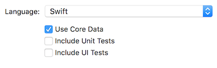

# Core Data
This page contain usage examples of common Core Data actions, [check here for NSPredicate usage examples](/) 💬


# Table of Contents

[Quick Start](#quick-start)

### Fetch

[Fetch all records](#fetch-all-records)

[Fetch records which match condition](#fetch-records-which-match-condition)

[Fetch the first N records sorted by property](#fetch-the-first-N-records-sorted-by-property)

### Delete

[Delete all records](#delete-all-records)

[Delete records which match a condition](#delete-records-which-match-a-condition)

[Delete a record](#delete-a-record)

### Update

[Batch update record](#batch-update-record)

[Update a record](#update-a-record)

### Insert

[Insert new record](#insert-new-record)


# Quick Start

When creating new iOS project, select **Use Core Data**



Xcode will add some boilerplate code for core data in AppDelegate and create a blank .xcdatamodeld if you tick this option.


# Fetch all records

```swift
var people : [Person] = [] 

guard let appDelegate = UIApplication.shared.delegate as? AppDelegate else {
    return
}

let context = appDelegate.persistentContainer.viewContext

// Cast the result returned from the fetchRequest as Person class
let fetchRequest = NSFetchRequest<Person>(entityName: "Person")

do {
  people = try context.fetch(fetchRequest)
} catch let error as NSError {
  print("Could not fetch. \(error), \(error.userInfo)")
}

self.tableView.reloadData()
```


# Fetch records which match condition
```swift
var people : [Person] = [] 

guard let appDelegate = UIApplication.shared.delegate as? AppDelegate else {
    return
}

let context = appDelegate.persistentContainer.viewContext

// Cast the result returned from the fetchRequest as Person class
let fetchRequest = NSFetchRequest<Person>(entityName: "Person")

// fetch records which match this condition
fetchRequest.predicate = NSPredicate(format: "money > %i", 100)

do {
  people = try context.fetch(fetchRequest)
} catch let error as NSError {
  print("Could not fetch. \(error), \(error.userInfo)")
}

self.tableView.reloadData()
```

 

# Fetch the first N records sorted by property

```swift
var people : [Person] = [] 

guard let appDelegate = UIApplication.shared.delegate as? AppDelegate else {
    return
}

let context = appDelegate.persistentContainer.viewContext

// Cast the result returned from the fetchRequest as Person class
let fetchRequest = NSFetchRequest<Person>(entityName: "Person")

// Sort using these properties, can put in mulitple sort descriptor here
fetchRequest.sortDescriptors = [NSSortDescriptor(key: "birthday", ascending: true)]
		
// Get the first record only
fetchRequest.fetchLimit = 1

do {
  people = try context.fetch(fetchRequest)
} catch let error as NSError {
  print("Could not fetch. \(error), \(error.userInfo)")
}

self.tableView.reloadData()
```


# Delete all records

```swift
guard let appDelegate = UIApplication.shared.delegate as? AppDelegate else {
    return
}

let context = appDelegate.persistentContainer.viewContext

// delete all records from Person entity
let fetchRequest = NSFetchRequest<NSFetchRequestResult>(entityName: "Person")
let deleteRequest = NSBatchDeleteRequest(fetchRequest: fetchRequest)

do {
  try context.execute(deleteRequest)
} catch let error as NSError {
  print("Could not delete all data. \(error), \(error.userInfo)")
}
```


# Delete records which match a condition

```swift
guard let appDelegate = UIApplication.shared.delegate as? AppDelegate else {
    return
}

let context = appDelegate.persistentContainer.viewContext

// get records which match this condition
let fetchRequest = NSFetchRequest<NSFetchRequestResult>(entityName: "Person")
fetchRequest.predicate = NSPredicate(format: "money > %i", 100)

// and delete them
let deleteRequest = NSBatchDeleteRequest(fetchRequest: fetchRequest)

do {
  try context.execute(deleteRequest)
} catch let error as NSError {
  print("Could not delete all data. \(error), \(error.userInfo)")
}
```


# Delete a record

```swift
// Refer to fetch records section above for fetching

let person = people[0]
context.delete(person)

do {
  // remember to call this to save the change
  try context.save()
} catch let error as NSError {
  print("Could not save. \(error), \(error.userInfo)")
}
```


# Batch update record

Batch update is fast because it doesn't validate the property, doesn't ensure referential integrity and doesn't refresh object that is already in context, read more about the caveats here:  [caveats of using batch update](https://www.bignerdranch.com/blog/new-in-core-data-and-ios-8-batch-updating/#whats-the-catch)


```swift
guard let appDelegate = UIApplication.shared.delegate as? AppDelegate else {
  return
}

let context = appDelegate.persistentContainer.viewContext

let entity =  NSEntityDescription.entity(forEntityName: "Person", in: context)!
let updateRequest = NSBatchUpdateRequest(entity: entity)

// only update persons who have money less than 10000
// can remove this line if you want to update all persons
updateRequest.predicate = NSPredicate(format: "money < %i", 10000)

// update the money to 10000, can add more attribute name and value to the hash if you want
updateRequest.propertiesToUpdate = ["money" : 10000]

// return the number of updated objects for the result
updateRequest.resultType = .updatedObjectsCountResultType

do {
  let result = try context.execute(updateRequest) as! NSBatchUpdateResult
  print("\(result.result ?? 0) objects updated")
  
} catch let error as NSError {
  print("Could not batch update. \(error), \(error.userInfo)")
}
```

 

# Update a record

```swift
// Refer to fetch records section above for fetching

let person = people[0]
person.name = "Tim Cook"

do {
  try context.save()
} catch let error as NSError {
  print("Could not save. \(error), \(error.userInfo)")
}
```


# Insert new record 

```swift
guard let appDelegate = UIApplication.shared.delegate as? AppDelegate else {
  return
}

let context = appDelegate.persistentContainer.viewContext

let person = NSEntityDescription.insertNewObject(forEntityName: "Person", into: context) as! Person

person.name = "Steve Jobs"
person.money = 10000000000
person.married = true
person.birthday = Date(timeIntervalSinceReferenceDate: -1446994588)

// can use KeyPath to modify attribute too
// person.setValue("Steve Jobs", forKeyPath: "name")

do {
  try context.save()
} catch let error as NSError {
  print("Could not save. \(error), \(error.userInfo)")
}
```

