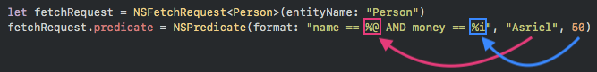

# NSPredicate

This page contains usage examples of NSPredicate, [check here for Core Data usage examples](coredata) 🔋

# Table of Contents


### Basic

[Predicate Format and Arguments](#predicate-format-and-arguments)

[String Format Specifier](#string-format-specifier)

[Basic Comparison](#basic-comparison)

[Compound Comparison](#compound-comparison)


### Techniques

[Reuse NSPredicate with substitution variable](#reuse-nspredicate-with-substitution-variable)


### Examples (Entity's property...)

[Is included in an Array of values](#is-included-in-an-array-of-values)

[Is not included in an Array of values](#is-not-included-in-an-array-of-values)


[Begins with certain string](#begins-with-certain-string)

[Contains certain string](#contains-certain-string)

[Ends with certain string](#ends-with-certain-string)

[Wildcard match with string](#wildcard-match-with-string)

[Regular Expression match with string](#regular-expression-match-with-string)


<div class="post-subscribe">
  <div class="post-subscribe-left">
    <h4> Get demo Xcode project with Core Data / NSPredicate sample code</h4>
    <p> 
      
    </p>
    <span>
      Try out NSPredicate / Core Data yourself!
    </span>
  </div>
        
  <div class="post-subscribe-right">
    <form action="https://www.getdrip.com/forms/87161541/submissions" method="post" data-drip-embedded-form="87161541">
      <div style="margin-bottom: 0.5rem;">
          <label for="drip-firstname">Name<span style="color:#952B45;">*</span></label><br>
          <input type="text" id="drip-firstname" name="fields[firstname]" value="">
      </div>
      <div>
          <label for="drip-email">Email Address<span style="color:#952B45;">*</span></label><br>
          <input type="email" id="drip-email" name="fields[email]" value="">
      </div>
      <div style="width:100%;">
        <br>
        <input type="submit" value="Send me the project file!" data-drip-attribute="sign-up-button">
        <br><br>
        <span style="font-size: 0.8rem;">+ Weekly-ish iOS Development tips to help you become a better iOS developer.<br> No Spam. Unsubscribe any time.</span>
      </div>
    </form>
  </div>
</div>

# Basics

## Predicate Format and Arguments

Say for a predicate which select Person that have a name "Asriel" and 50 money : 

```swift
let fetchRequest = NSFetchRequest<Person>(entityName: "Person")
fetchRequest.predicate = NSPredicate(format: "name == %@ AND money == %i", "Asriel", 50)
```


The format is `"name == %@ AND money == %i"`.  

 `%@`  and `%i` are the format specifiers, `%@` will be substituted with an **object** (eg: String, date etc), whereas `%i` will be substituted with an **integer**.


The substitution happens as illustrated below, following the order from left to right : 



`%@` (object format specifier) will be replaced with "Asriel"  and `%i` (integer format specifier) will be replaced with 50. **Asriel** and **50** is the **arguments**.


After substitution, the predicate will become `"name == 'Asriel' AND money = 50"` , meaning the NSPredicate will find for Person that have name **Asriel** and **50** money.  

   <br>

> But why can't I just use "name == 'Asriel' AND money = 50" instead of having to use the format specifier thingy?

Yes of course you can! For simple filter which require a hardcoded value I recommend using it. The format specifier substitution is for variable value usually, like this : 

```swift
// user input a name into textfield
var name = nameTextField.text!

// filter based on the name user has inputed
let fetchRequest = NSFetchRequest<Person>(entityName: "Person")
fetchRequest.predicate = NSPredicate(format: "name == %@", name)
```


## String Format Specifier

You can check the full list in [Apple official documentation](https://developer.apple.com/library/archive/documentation/Cocoa/Conceptual/Strings/Articles/formatSpecifiers.html). `%@` is used for objects like String, Date, Array etc.

`%K` is used for **K**eypath (the property of the entity).

```swift
let integerPredicate = NSPredicate(format: "money == %i", 10000)
let doublePredicate = NSPredicate(format: "perimeter > %f", 3.14159)
let stringPredicate = NSPredicate(format: "name == %@", "Asriel")

// eg: find loans that are overdue
let datePredicate = NSPredicate(format: "due_date < %@", Date())

// the above can be replaced with this
let keyPathDatePredicate = NSPredicate(format: "%K < %@", "due_date", Date())
```


## Basic Comparison

Basic comparison symbol like `==`, `>` , `<` etc.

```swift
let equalPredicate = NSPredicate(format: "name == %@", "Steve Jobs")
let notEqualPredicate = NSPredicate(format: "name != %@", "Steve Jobs")

let greaterPredicate = NSPredicate(format: "money > %i", 10000)
let greaterOrEqualPredicate = NSPredicate(format: "money >= %i", 10000)

let lesserPredicate = NSPredicate(format: "money < %i", 10000)
let lesserOrEqualPredicate = NSPredicate(format: "money <= %i", 10000)
```


## Compound Comparison

Join two or more condition together with `OR` , `AND`. 

```swift
// Retrieve records where all conditions are met
let andPredicate = NSPredicate(format: "name == %@ AND money >= %i", "Steve Jobs", 10000)

// Retrieve records as long as one of the condition is met
let orPredicate = NSPredicate(format: "name == %@ OR money >= %i", "Steve Jobs", 10000)

```

# Techniques

## Reuse NSPredicate with substitution variable

As it is relatively time consuming for the app to parse the format string of the NSPredicate, we should try to reduce creating multiple NSPredicate and reuse similar NSPredicate as much as possible. We can use variable value in NSPredicate denoted by `$` sign, and substitute its value by calling `withSubstitutionVariables` method.

```swift
// Persons' name : ["Asriel", "Asgore", "Toriel", "Frisk", "Flowey"]
let context = appDelegate.persistentContainer.viewContext
let fetchRequest = NSFetchRequest<Person>(entityName: "Person")

let reusablePredicate = NSPredicate(format: "name BEGINSWITH $startingName")

// replace $startingName with 'As'
fetchRequest.predicate = reusablePredicate.withSubstitutionVariables(["startingName" : "As"])

do {
  people = try context.fetch(fetchRequest)
  // ["Asriel", "Asgore"]
} catch let error as NSError {
  print("Could not fetch. \(error), \(error.userInfo)")
}

// reuse the predicate with a different starting name
// replace $startingName with 'F'
fetchRequest.predicate = reusablePredicate.withSubstitutionVariables(["startingName" : "F"])

do {
  people += try context.fetch(fetchRequest)
  // ["Asriel", "Asgore", "Flowey", "Frisk"]
} catch let error as NSError {
  print("Could not fetch. \(error), \(error.userInfo)")
}
```


You can use multiple variables like `name BEGINSWITH $startingName AND money >  $amount` , then call `withSubstitutionVariables(["startingName" : "As", "amount": 50])`.


# Examples

## Is included in an Array of values

```swift
let wantedItemIDs = [1, 2, 3, 5, 8, 13, 21]

// Retrieve record with item_id which is inside the wantedItemIDs array
let inclusivePredicate = NSPredicate(format: "item_id IN %@", wantedItemIDs)
```


## Is not included in an Array of values

```swift
let unwantedItemIDs = [1, 2, 3, 5, 8, 13, 21]

// Retrieve record with item_id which is not inside the unwantedItemIDs array
let exclusivePredicate = NSPredicate(format: "NOT (item_id IN %@)", unwantedItemIDs)
```


## Begins with certain string

```swift
// Works for "Kim Jong Un", "Kim Kardashian"
let beginPredicate = NSPredicate(format: "name BEGINSWITH %@", "Kim")

// Works for "macintosh", "Macintosh"
let beginCaseInsensitivePredicate = NSPredicate(format: "name BEGINSWITH[c] %@", "mac")
// the [c] means case insensitive match
```


## Contains certain string

```swift
// Works for "Steven Paul Jobs", "Logan Paul"
let containPredicate = NSPredicate(format: "name CONTAINS %@", "Paul")

// Works for "Shop1", "shopping", "my shop", "bishop"
let containCaseInsensitivePredicate = NSPredicate(format: "name CONTAINS[c] %@", "shop")
// the [c] means case insensitive match
```


## Ends with certain string

```swift
// Works for "Steve Jobs", "Lisa Jobs"
let endPredicate = NSPredicate(format: "name ENDSWITH %@", "Jobs")

// Works for "mundane jobs", "Steve Jobs"
let endCaseInsensitivePredicate = NSPredicate(format: "name ENDSWITH[c] %@", "jobs")
// the [c] means case insensitive match
```


## Wildcard match with string

`LIKE` is used for wildcard match.


Wildcard match is used to match certain pattern of string, eg: to match `img1.png` , `img10.png` and`img100.png`, we can use `filename LIKE 'img*.png'`. The `*` means **zero or more characters** between `img` and `.png` is accepted.

```swift
let filenameArr = ["img.png", "img1.png", "img2.png", "img10.png", "img100.png", "img200.txt", "img300.csv"]

let pngPredicate = NSPredicate(format: "SELF LIKE %@", "img*.png")

let imageArr = filenameArr.filter(){ filename in
	pngPredicate.evaluate(with: filename)
}
print(imageArr)
// ["img.png", "img1.png", "img2.png", "img10.png", "img100.png"]
```


To match **exactly one character**, we can use `?` , eg: `filename LIKE 'img?.png'` will match `img1.png` but not `img10.png` as it only take in one character between `img` and `.png`.

```swift
let filenameArr = ["img.png", "img1.png", "img2.png", "img10.png", "img100.png", "img200.txt", "img300.csv"]

let singleCharPngPredicate = NSPredicate(format: "SELF LIKE %@", "img?.png")

let imageArr2 = filenameArr.filter(){ filename in
	singleCharPngPredicate.evaluate(with: filename)
}
print(imageArr2)
// ["img1.png", "img2.png"]
```


## Regular Expression match with string

`MATCHES` is used for regular expression match.


Regular expression is used for complex string pattern matching. Swift uses [ICU regular expression format](http://userguide.icu-project.org/strings/regexp).
For learning regular expression, I recommend [this tutorial](https://medium.com/factory-mind/regex-tutorial-a-simple-cheatsheet-by-examples-649dc1c3f285).


Eg: `filename MATCHES 'img\\d{1,3}\\.png'` will match filename with 1-3 digits between `img` and `.png` like `img1.png`, `img10.png` and `img100.png` but not `img1000.png` .  Double backslash is used to escape the backslash character `\` .

```swift
let filenameArr = ["img.png", "img1.png", "imgABC.png", "img10.png", "img100.png", "img9000.png", "img12345.png"]

// matches filename that has 1-3 digits between 'img' and '.png'
let regexPredicate = NSPredicate(format: "SELF MATCHES %@", "img\\d{1,3}\\.png")

let filteredArr = filenameArr.filter(){ filename in
    regexPredicate.evaluate(with: filename)
}
print(filteredArr)
// ["img1.png", "img10.png", "img100.png"]
```

